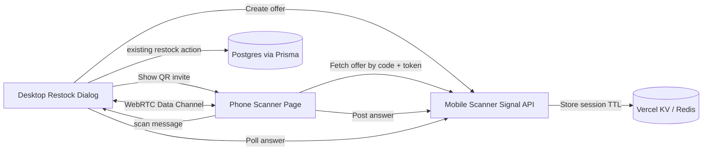

# Mobile Scanner WebRTC Plan for Sparepart Restock

This document defines the implementation plan for a **Scan via Phone** feature in the **Sparepart Restock** flow only. The phone camera scans the barcode, sends the scanned value to the desktop browser through a WebRTC Data Channel, and the authenticated desktop session performs the existing restock mutation.

## Goals

- Let staff/admin use a phone camera as a barcode scanner while the desktop restock dialog is open.
- Pair desktop and phone by scanning a QR code.
- Send scanned barcode values from phone to desktop through WebRTC Data Channel.
- Reuse the existing desktop restock flow after receiving a scan.
- Keep the first implementation scoped to `SparepartRestockDialog` only.

## Non-Goals

- Do not let the phone perform inventory mutations directly.
- Do not add this scanner to service forms, IMEI fields, stock audit, or other inputs in this phase.
- Do not replace the existing hardware scanner/keyboard-wedge support.
- Do not introduce WebSocket signaling. HTTP polling with Redis/KV is enough for the first phase.
- Do not persist phone scan history.

## Repository Context

- The app uses Next.js 16 App Router.
- Route protection is handled in `proxy.ts`, not `middleware.ts`.
- Redis/KV is already available through `@vercel/kv` and used by `lib/auth.ts` for better-auth secondary storage.
- The current restock flow is in `components/dashboard/inventory/sparepart-restock-dialog.tsx`.
- The restock mutation uses `restockSparepart` from `actions/inventory.ts`.
- Barcode/name lookup uses `searchSpareparts(tokoId, query)` from `actions/inventory.ts`.
- The admin inventory page is `app/(dashboard)/[tokoid]/admin/inventory/page.tsx` and renders `InventoryTabs`.

## New Dependencies

Install:

```bash
bun add qrcode.react @zxing/browser
```

- `qrcode.react`: renders the desktop pairing QR code.
- `@zxing/browser`: scans barcodes from the phone camera with broad barcode format support.

Alternative: use native `BarcodeDetector`, but browser support is less consistent. For the first implementation, `@zxing/browser` is recommended.

## Architecture



## Core Principles

- Redis/KV is only used for WebRTC signaling: offer, answer, token, TTL, and metadata.
- Scanned values do not need to pass through the server after WebRTC is connected.
- Inventory mutation stays on the authenticated desktop session, preserving existing auth, role, and toko access checks.
- The phone scanner route is public, but joining requires both a short-lived code and an unguessable token from the QR link.

## User Flow

1. The desktop user opens the inventory page.
2. The user opens `Restock Sparepart`.
3. The user clicks `Scan via Phone`.
4. The desktop creates a WebRTC offer and stores a signaling session in Redis/KV.
5. The desktop shows a QR code containing a scanner URL, for example:

```text
https://app.example.com/scanner/123456?token=<random-token>
```

6. The phone opens the QR URL.
7. The phone requests camera permission.
8. The phone fetches the offer from the signaling API and creates an answer.
9. The desktop polls for the answer and completes the WebRTC connection.
10. The phone shows `connected` status.
11. The phone scans a sparepart barcode.
12. The phone sends the scanned value to the desktop through the data channel.
13. The desktop runs the existing restock behavior:

- Set the barcode input value.
- Mark the input as scanner input.
- Search for an exact sparepart match.
- Automatically restock using the current `qty` value.
- Update the sparepart list and stock-in history.
- Reset the input so the next scan can be processed.

## New Files

### `lib/webrtc.ts`

Responsibilities:

- Export `rtcConfig` with public STUN servers.
- Export `waitForIceGatheringComplete(pc)`.
- Define the mobile scanner data-channel message protocol.

Suggested types:

```ts
export type MobileScannerMessage =
  | { type: "ready"; at: number }
  | { type: "scan"; value: string; format?: string; at: number }
  | { type: "error"; message: string; at: number };

export type MobileScannerConnectionState =
  | "idle"
  | "pairing"
  | "connecting"
  | "connected"
  | "disconnected"
  | "failed";
```

### `lib/mobile-scanner-signaling-store.ts`

Responsibilities:

- Manage signaling sessions in `@vercel/kv`.
- Apply a short session TTL, recommended 10 minutes.
- Validate guest tokens.
- Validate host ownership.

Session shape:

```ts
export interface MobileScannerSignalSession {
  code: string;
  tokenHash: string;
  tokoId: string;
  ownerUserId: string;
  offer: string;
  answer: string | null;
  createdAt: number;
  updatedAt: number;
}
```

Security notes:

- Prefer storing a hash of the token, not the raw token.
- The raw token is returned once to the desktop so it can build the QR URL.
- Session key format: `mobile-scanner:session:${code}`.
- TTL: 600 seconds.

Required functions:

```ts
createMobileScannerSession(input)
getMobileScannerSessionForHost(code, userId)
getMobileScannerSessionForGuest(code, token)
setMobileScannerAnswer(code, token, answer)
deleteMobileScannerSession(code, userId)
```

### `app/api/mobile-scanner/signal/route.ts`

Responsibilities:

- Provide the WebRTC signaling route handler.
- Use authenticated host endpoints.
- Use token-protected guest endpoints.
- Keep the default Node.js runtime.

#### `POST /api/mobile-scanner/signal`

Creates an offer session from desktop.

Request:

```json
{
  "type": "offer",
  "tokoId": "...",
  "sdp": "{...}"
}
```

Response:

```json
{
  "code": "123456",
  "token": "random-token",
  "expiresIn": 600
}
```

Validation:

- User must be logged in.
- User must have access to `tokoId` using `requireTokoAccess` or `getAuthUser` + `canAccessToko`.
- `sdp` must be a non-empty string.

#### `GET /api/mobile-scanner/signal?code=123456&token=...`

Lets the phone fetch the offer.

Response:

```json
{
  "offer": "{...}",
  "tokoId": "..."
}
```

#### `POST /api/mobile-scanner/signal`

Lets the phone submit an answer.

Request:

```json
{
  "type": "answer",
  "code": "123456",
  "token": "random-token",
  "sdp": "{...}"
}
```

Response:

```json
{ "ok": true }
```

#### `GET /api/mobile-scanner/signal?code=123456&role=host`

Lets the desktop poll for the answer.

Response when the answer exists:

```json
{
  "answer": "{...}"
}
```

Response before the answer exists:

```json
{
  "answer": null
}
```

### `hooks/use-mobile-scanner-host.ts`

Client hook for the desktop restock dialog.

Input:

```ts
interface UseMobileScannerHostOptions {
  tokoId: string;
  onScan: (value: string) => void | Promise<void>;
}
```

Return:

```ts
interface UseMobileScannerHostReturn {
  state: MobileScannerConnectionState;
  code: string | null;
  inviteUrl: string | null;
  error: string | null;
  startPairing: () => Promise<void>;
  disconnect: () => void;
  clearError: () => void;
}
```

Responsibilities:

- Create `RTCPeerConnection`.
- Create the `mobile-scanner` data channel.
- Create an offer and wait for ICE gathering to complete.
- POST the offer to the signaling API.
- Build `inviteUrl` from `window.location.origin`.
- Poll for the answer until available or timed out.
- Set the remote answer.
- Parse data-channel messages.
- Call `onScan(value)` for `scan` messages.
- Clean up the peer connection, data channel, intervals, and timeouts.

Polling behavior:

- Interval: 1000 ms.
- Pairing timeout: 120 seconds.
- Stop polling after connected, disconnected, failed, or unmount.

### `app/scanner/[code]/page.tsx`

Public phone scanner page.

Responsibilities:

- Read `code` from async params.
- Pass `code` into the client component.
- No server-side auth required.
- Render simple metadata if needed.

Next.js 16 params shape:

```ts
interface ScannerPageProps {
  params: Promise<{ code: string }>;
}
```

### `components/mobile-scanner/mobile-scanner-client.tsx`

Client component for the phone scanner UI.

Responsibilities:

- Read `token` from `useSearchParams`.
- Fetch the offer from the signaling API.
- Create the WebRTC answer.
- POST the answer.
- Open the camera.
- Decode barcodes with `@zxing/browser`.
- Send scan results through the data channel.
- Provide a manual input fallback.
- Show camera and connection status.

Minimal UI:

- Header: `Phone Scanner`.
- Status badge: pairing/connected/error.
- Mobile-first video preview.
- Buttons: `Start Camera`, `Stop`, `Send Manual`.
- Manual input fallback.
- Last scanned value.

Scanner behavior:

- Prefer the rear camera when available.
- Ignore duplicate scan values for about 1500 ms.
- Vibrate briefly after a successful scan if `navigator.vibrate` exists.
- Continue scanning after a successful send so multiple items can be scanned in sequence.

### `components/dashboard/inventory/mobile-scanner-pairing-dialog.tsx`

Desktop pairing dialog.

Props:

```ts
interface MobileScannerPairingDialogProps {
  open: boolean;
  onOpenChange: (open: boolean) => void;
  tokoId: string;
  onScan: (value: string) => void | Promise<void>;
}
```

Responsibilities:

- Use `useMobileScannerHost`.
- Render the QR code for `inviteUrl`.
- Show the pair code.
- Show connection status.
- Provide retry/disconnect controls.
- Auto-start pairing when opened.

UI components:

- `Dialog`
- `Button`
- `Badge`
- `Card` or a simple semantic layout
- `QRCodeSVG` from `qrcode.react`

## Files To Change

### `components/dashboard/inventory/sparepart-restock-dialog.tsx`

Add state:

```ts
const [mobileScannerOpen, setMobileScannerOpen] = useState(false);
```

Add mobile scan handler:

```ts
const handleMobileScan = useCallback(async (value: string) => {
  isScannerInputRef.current = true;
  await processScannerValue(value);
}, [processScannerValue]);
```

Recommended small refactor:

- Move the existing `Enter` key scanner logic into a reusable function, for example `processScannerValue(rawValue: string)`.
- Use this function for keyboard scanner input, dev simulation, and mobile scanner input.
- Avoid duplicating exact-match search and `performRestock` logic.

`processScannerValue` behavior:

1. Trim the scanned value.
2. Validate that it is not empty.
3. Validate `qty`.
4. Clear any pending search timeout.
5. Set search loading state.
6. Call `searchSpareparts(tokoId, trimmedValue)`.
7. If there is an exact ID match, call `performRestock(exactIdMatch.id, qtyValue)`.
8. If there is one non-exact result, set `foundSparepart`.
9. If there are multiple results, show the result list.
10. If there are no results, show the existing not-found error.

Add a button near the barcode input:

```tsx
<Button type="button" variant="outline" onClick={() => setMobileScannerOpen(true)}>
  <RiQrScan2Line data-icon="inline-start" />
  Scan via Phone
</Button>
```

The icon can be adjusted to an available Remix icon, such as `RiQrScan2Line` or `RiSmartphoneLine`.

Render the pairing dialog:

```tsx
<MobileScannerPairingDialog
  open={mobileScannerOpen}
  onOpenChange={setMobileScannerOpen}
  tokoId={tokoId}
  onScan={handleMobileScan}
/>
```

Important notes:

- Do not close the restock dialog when the pairing dialog opens.
- Clean up the scanner connection when the restock dialog unmounts/closes.

## Data Channel Message Protocol

Phone to desktop scan message:

```json
{
  "type": "scan",
  "value": "sparepart-id-or-barcode",
  "format": "CODE_128",
  "at": 1710000000000
}
```

Phone ready message:

```json
{
  "type": "ready",
  "at": 1710000000000
}
```

Phone error message:

```json
{
  "type": "error",
  "message": "Camera permission denied",
  "at": 1710000000000
}
```

Desktop should ignore unknown message types.

## Error Handling

### Desktop

- Failed offer creation: show an error in the pairing dialog.
- Failed signaling session creation: show an error and retry button.
- Pairing timeout: set state to `failed` and show retry.
- Data channel closed: set state to `disconnected` and allow pairing again.
- Invalid scan message: ignore it and optionally log a warning.
- Sparepart not found: reuse the existing restock dialog error.

### Phone

- Missing token: show invalid link error.
- Expired/unknown session: show QR expired error.
- Camera permission denied: show manual input fallback.
- No camera found: show manual input fallback.
- WebRTC failed: show reconnect instructions.

## Security

- Host session creation requires authentication.
- Host answer polling requires authentication and `ownerUserId` must match the session creator.
- Guest can only fetch the offer and submit an answer when the token is valid.
- Token should be random and long enough, for example `nanoid(32)` or equivalent.
- The 6-digit pair code is not enough as a secret; the QR token is the real secret.
- Redis/KV TTL should be short, recommended 10 minutes.
- Delete the session when the desktop disconnects if possible.
- Guest endpoints must not mutate inventory.
- Guest responses should not expose user identity or sensitive toko data.

## Deployment Notes

- Vercel serverless is safe because signaling state is stored in Vercel KV/Redis.
- Phone camera access requires a secure context:

- Production HTTPS works.
- Desktop localhost usually works for camera access.
- Phone accessing a LAN HTTP address is usually not considered secure, so camera access can be blocked.
- For local phone testing, use an HTTPS dev tunnel or a deployed preview.

## UX Details

- `Scan via Phone` only appears in the restock dialog.
- Pairing dialog copy:

```text
Scan this QR code with your phone. After it connects, barcodes scanned from your phone will be sent to this restock dialog automatically.
```

- After connected, the user may close the pairing dialog or leave it open. The connection should stay alive while the restock dialog is mounted.
- Successful mobile restock uses the existing success toast.
- After a successful restock, the input resets like the existing hardware scanner flow.

## Manual Testing

### Pairing Test

1. Run the app.
2. Log in as a user with inventory access.
3. Open the inventory page.
4. Open `Restock Sparepart`.
5. Click `Scan via Phone`.
6. Verify the QR code appears.
7. Open the QR link on a phone.
8. Verify the desktop status becomes connected.
9. Verify the phone status becomes connected.

### Successful Scan Test

1. Use an existing sparepart barcode label that encodes the sparepart ID.
2. Scan it from the phone.
3. Verify the desktop receives the value.
4. Verify restock runs automatically using the current qty.
5. Verify table stock increases.
6. Verify stock-in history is updated.

### Manual Fallback Test

1. Open the scanner page on the phone.
2. Deny camera permission or stop the camera.
3. Enter a sparepart ID manually.
4. Send it.
5. Verify the desktop processes it like a camera scan.

### Error Test

1. Scan an invalid barcode.
2. Verify the desktop shows the existing not-found error.
3. Wait until the session TTL expires.
4. Verify the phone shows an expired session error.
5. Close the restock dialog.
6. Verify polling and peer connection are cleaned up.

## Technical Verification

Run:

```bash
bun run lint
bun run build
```

There is no dedicated test/typecheck script in this repo. `bun run build` is the main TypeScript and Next.js convention verification path.

## Implementation Phases

### Phase 1: Redis/KV Signaling

- Create `lib/mobile-scanner-signaling-store.ts`.
- Create `app/api/mobile-scanner/signal/route.ts`.
- Validate host auth and guest token access.
- Manually test endpoint behavior if needed.

### Phase 2: WebRTC Host Hook

- Create `lib/webrtc.ts`.
- Create `hooks/use-mobile-scanner-host.ts`.
- Implement offer creation, answer polling, data channel receive, and cleanup.

### Phase 3: Phone Scanner Page

- Create `app/scanner/[code]/page.tsx`.
- Create `components/mobile-scanner/mobile-scanner-client.tsx`.
- Implement guest answer creation.
- Implement ZXing camera scanning and manual fallback.

### Phase 4: Desktop Pairing UI

- Create `components/dashboard/inventory/mobile-scanner-pairing-dialog.tsx`.
- Render QR code, pair code, status, retry, and disconnect.
- Auto-start pairing when the dialog opens.

### Phase 5: Restock Integration

- Refactor `SparepartRestockDialog` scanner processing into a reusable function.
- Add the `Scan via Phone` button.
- Add the pairing dialog.
- Route mobile scan values into the existing restock process.

### Phase 6: Verification and Cleanup

- Run lint and build.
- Fix warnings/errors introduced by this feature.
- Manually test with desktop and phone.

## Risks and Mitigations

| Risk | Impact | Mitigation |
|---|---|---|
| Camera does not work on LAN HTTP | Phone cannot scan during local dev | Use HTTPS preview/tunnel for phone testing |
| NAT/firewall blocks WebRTC | Phone cannot connect | Use Google STUN and provide retry; consider TURN later if needed |
| Redis session expires during pairing | QR link stops working | Show retry/regenerate QR button |
| Duplicate fast scans | Double restock | Deduplicate same scan on phone for 1.5 seconds and ignore scans while desktop is processing |
| Dialog closes while polling | Interval or peer connection leak | Cleanup in hook effects and disconnect on unmount |
| QR token leaks | Temporary guest can join | Short TTL, long random token, no inventory mutation from guest |

## Done Criteria

- User can open the restock dialog and click `Scan via Phone`.
- Pairing QR code appears and can be opened from a phone.
- Phone connects to desktop through WebRTC.
- Phone can scan a barcode with the camera.
- Desktop receives the scan and auto-restocks the sparepart using the current qty.
- Existing manual input and hardware scanner behavior still works.
- Mobile scanner is not added to any other page or form.
- `bun run lint` succeeds or any relevant issue is documented.
- `bun run build` succeeds or any relevant issue is documented.
