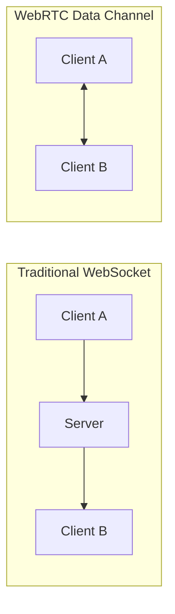
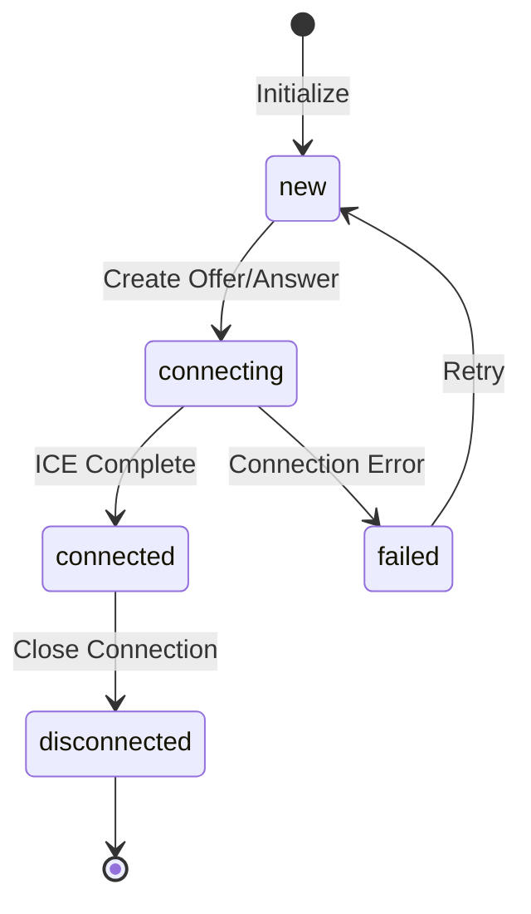
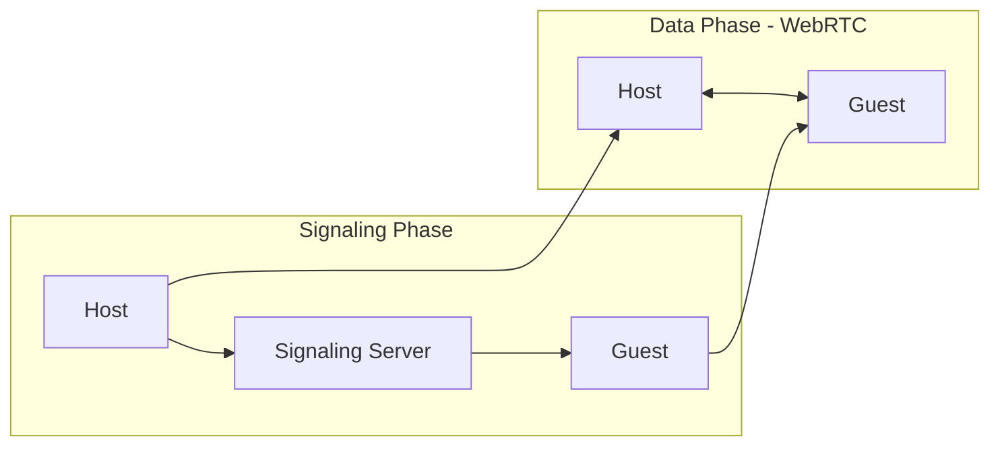

# Dokumentasi Implementasi WebRTC Data Channel

Dokumentasi ini menjelaskan implementasi WebRTC peer-to-peer communication menggunakan Data Channel pada aplikasi Next.js.

## Daftar Isi

1. [Konsep Dasar WebRTC](#konsep-dasar-webrtc)
2. [Arsitektur Implementasi](#arsitektur-implementasi)
3. [Flow Koneksi Peer-to-Peer](#flow-koneksi-peer-to-peer)
4. [Komponen Utama](#komponen-utama)
5. [Signaling Server](#signaling-server)
6. [Catatan Deployment Vercel](#catatan-deployment-vercel)
7. [QR Code Integration](#qr-code-integration)
8. [Custom UI](#custom-ui)

---

## Konsep Dasar WebRTC

WebRTC (Web Real-Time Communication) adalah teknologi yang memungkinkan komunikasi real-time peer-to-peer langsung antara browser tanpa memerlukan server intermediary untuk data transfer.

### Mengapa WebRTC Data Channel?



| Aspek | WebSocket | WebRTC Data Channel |
|-------|-----------|---------------------|
| Latensi | Tinggi (server intermediary) | Rendah (direct P2P) |
| Server Load | Tinggi | Rendah (hanya signaling) |
| Bandwidth Cost | Server menangani semua data | Server hanya untuk signaling |
| Privacy | Data melewati server | Data langsung antar peer |

### Komponen WebRTC

1. **SDP (Session Description Protocol)** - Deskripsi session yang berisi informasi media dan codec
2. **ICE (Interactive Connectivity Establishment)** - Framework untuk menemukan path koneksi optimal
3. **STUN Server** - Server yang membantu peer menemukan public IP address
4. **Data Channel** - Channel untuk transfer data arbitrary (tidak hanya media)

---

## Arsitektur Implementasi

```
web/
├── lib/
│   ├── webrtc.ts          # Core WebRTC utilities
│   └── signaling-store.ts # In-memory signaling store (DEV ONLY)
├── hooks/
│   └── useWebRTC.ts       # React hook untuk WebRTC state management
├── components/
│   ├── ConnectionPanel.tsx # UI untuk signaling
│   ├── ChatPanel.tsx       # UI untuk chat
│   └── ConnectionStatus.tsx # Status indicator
└── app/
    └── api/
        └── signal/
            └── route.ts    # Signaling API endpoint
```

---

## Flow Koneksi Peer-to-Peer

### Diagram Sequence Koneksi

```mermaid
sequenceDiagram
    participant Host as Host (Initiator)
    participant SignalAPI as Signaling API
    participant Guest as Guest (Joiner)
    
    Note over Host: 1. Host membuat offer
    Host->>SignalAPI: POST /api/signal {type: offer, sdp}
    SignalAPI-->>Host: {code: "123456"}
    
    Note over Host,Guest: 2. Host share kode/link ke Guest
    Host-->>Guest: Share link/QR code
    
    Note over Guest: 3. Guest join dengan kode
    Guest->>SignalAPI: GET /api/signal?code=123456
    SignalAPI-->>Guest: {offer: sdp}
    
    Note over Guest: 4. Guest membuat answer
    Guest->>SignalAPI: POST /api/signal {type: answer, code, sdp}
    SignalAPI-->>Guest: {ok: true}
    
    Note over Host: 5. Host polling untuk answer
    Host->>SignalAPI: GET /api/signal?code=123456
    SignalAPI-->>Host: {offer, answer: sdp}
    
    Note over Host,Guest: 6. WebRTC Connection Established
    Host<-->Guest: Direct P2P Data Channel
```

### State Diagram Koneksi



---

## Komponen Utama

### 1. WebRTC Utilities (`lib/webrtc.ts`)

File ini berisi fungsi-fungsi core untuk WebRTC connection.

#### Konfigurasi STUN Server

```typescript
export const rtcConfig: RTCConfiguration = {
  iceServers: [
    { urls: 'stun:stun.l.google.com:19302' },
    { urls: 'stun:stun1.l.google.com:19302' },
    { urls: 'stun:stun2.l.google.com:19302' },
    { urls: 'stun:stun3.l.google.com:19302' },
    { urls: 'stun:stun4.l.google.com:19302' },
  ],
};
```

**Penjelasan:**
- STUN server digunakan untuk NAT traversal
- Google menyediakan STUN server public gratis
- Multiple server untuk redundancy

#### Fungsi Utama

| Fungsi | Deskripsi |
|--------|-----------|
| `createPeerConnection()` | Membuat RTCPeerConnection baru |
| `createOffer()` | Membuat SDP offer untuk initiator |
| `createAnswer()` | Membuat SDP answer untuk joiner |
| `setRemoteDescription()` | Set SDP dari remote peer |
| `waitForIceGatheringComplete()` | Wait ICE gathering selesai |

### 2. useWebRTC Hook (`hooks/useWebRTC.ts`)

React hook yang mengelola seluruh WebRTC state dan lifecycle.

#### State yang Dikelola

```typescript
interface UseWebRTCReturn {
  // State
  connectionState: ConnectionState;  // 'new' | 'connecting' | 'connected' | 'disconnected' | 'failed'
  localOffer: string;                // SDP offer (JSON string)
  localAnswer: string;               // SDP answer (JSON string)
  iceCandidates: string[];           // ICE candidates array
  messages: ChatMessage[];           // Chat messages
  error: string | null;              // Error state
  
  // Actions
  createOfferForPeer: () => Promise<void>;
  createOfferForPeerWithResult: () => Promise<string | null>;
  setRemoteOfferAndCreateAnswer: (offer: string) => Promise<void>;
  setRemoteOfferAndCreateAnswerWithResult: (offer: string) => Promise<string | null>;
  setRemoteAnswer: (answer: string) => Promise<void>;
  addIceCandidate: (candidate: string) => Promise<void>;
  sendMessage: (text: string) => void;
  disconnect: () => void;
  clearError: () => void;
}
```

#### Data Channel Setup

```typescript
// Initiator (Host) - Create data channel before offer
const channel = pc.createDataChannel('chat', {
  ordered: true,  // Messages delivered in order
});
setupDataChannel(channel);

// Joiner (Guest) - Listen for incoming data channel
pc.ondatachannel = (event) => {
  dataChannelRef.current = event.channel;
  setupDataChannel(event.channel);
};
```

---

## Signaling Server

### Konsep Signaling

WebRTC membutuhkan signaling mechanism untuk exchange SDP dan ICE candidates. Signaling tidak dilakukan oleh WebRTC itself - implementasi terserah developer.



### API Endpoints

#### POST `/api/signal` - Create Session atau Submit Answer

```typescript
// Request: Create Offer Session
{
  type: 'offer',
  sdp: string  // JSON stringified RTCSessionDescriptionInit
}

// Response
{
  code: string  // 6-digit pair code
}

// Request: Submit Answer
{
  type: 'answer',
  code: string,  // 6-digit pair code
  sdp: string    // JSON stringified RTCSessionDescriptionInit
}

// Response
{
  ok: true
}
```

#### GET `/api/signal?code=XXX` - Get Session

```typescript
// Response
{
  offer: string,      // SDP offer
  answer: string | null  // SDP answer (null jika belum ada)
}
```

---

## Catatan Deployment Vercel

### ⚠️ WAJIB: Gunakan Database untuk Production

Implementasi saat ini menggunakan **in-memory Map** yang **tidak akan bekerja di Vercel** karena:

1. Vercel serverless functions bersifat **stateless** - data hilang setelah request selesai
2. Setiap request bisa di-handle oleh **instance berbeda** - data tidak shared
3. Memory tidak persistent - data hilang saat server restart

### Solusi: Ganti dengan Database

**Rekomendasi: Upstash Redis** (Free tier available)

```typescript
// lib/signaling-store.ts - Ganti dengan Redis
import { Redis } from '@upstash/redis';

const redis = Redis.fromEnv();

export async function createSession(offer: string) {
  const code = Math.floor(100000 + Math.random() * 900000).toString();
  await redis.set(`session:${code}`, JSON.stringify({ offer }), { ex: 600 });
  return code;
}

export async function getSession(code: string) {
  const data = await redis.get(`session:${code}`);
  return data ? JSON.parse(data as string) : null;
}

export async function setSessionAnswer(code: string, answer: string) {
  const existing = await getSession(code);
  if (!existing) return false;
  await redis.set(`session:${code}`, JSON.stringify({ ...existing, answer }), { ex: 600 });
  return true;
}
```

**Setup Upstash:**
1. Buat account gratis di [upstash.com](https://upstash.com)
2. Create Redis database
3. Copy credentials ke Vercel Environment Variables:
   - `UPSTASH_REDIS_REST_URL`
   - `UPSTASH_REDIS_REST_TOKEN`

**Alternatif lain:**
- PostgreSQL + Prisma (Supabase, Neon - free tier)
- Vercel KV (paid)

---

## QR Code Integration

### Library: qrcode.react

Library populer untuk generate QR code di React. Mudah digunakan dan mendukung SVG output.

**Install:**
```bash
bun add qrcode.react
# atau
npm install qrcode.react
```

### Contoh Implementasi

```tsx
import { QRCodeSVG } from 'qrcode.react';

function InvitePanel({ inviteLink }: { inviteLink: string }) {
  return (
    <div className="flex justify-center">
      <div className="rounded-xl bg-white p-3 shadow-sm">
        <QRCodeSVG
          value={inviteLink}
          size={160}
          level="M"
          bgColor="transparent"
          fgColor="currentColor"
          className="text-zinc-950 dark:text-zinc-50"
        />
      </div>
    </div>
  );
}
```

### Props QRCodeSVG

| Prop | Type | Default | Deskripsi |
|------|------|---------|-----------|
| `value` | string | (required) | URL/text untuk encode |
| `size` | number | 128 | Ukuran QR code (pixels) |
| `level` | 'L' \| 'M' \| 'Q' \| 'H' | 'L' | Error correction level |
| `bgColor` | string | '#FFFFFF' | Background color |
| `fgColor` | string | '#000000' | Foreground color |
| `includeMargin` | boolean | false | Add margin around QR |

### Error Correction Level

| Level | Recovery Capacity | Use Case |
|-------|-------------------|----------|
| L | ~7% | Clean environment |
| M | ~15% | Recommended for most cases |
| Q | ~25% | Moderate damage expected |
| H | ~30% | High damage expected |

**Recommendation:** Gunakan level `M` untuk balance antara ukuran dan reliability.

---

## Custom UI

UI components yang disediakan adalah contoh implementasi. User dapat custom sesuai kebutuhan.

### Contoh: Minimal Connection UI

```tsx
// components/MinimalConnection.tsx
'use client';

import { useWebRTC } from '@/hooks/useWebRTC';

export function MinimalConnection() {
  const {
    connectionState,
    createOfferForPeerWithResult,
    setRemoteOfferAndCreateAnswerWithResult,
    setRemoteAnswer,
    sendMessage,
    messages,
  } = useWebRTC();
  
  const handleCreateOffer = async () => {
    const offer = await createOfferForPeerWithResult();
    // Send offer to peer via your signaling mechanism
    console.log('Offer:', offer);
  };
  
  return (
    <div>
      <button onClick={handleCreateOffer}>
        Create Offer
      </button>
      {/* Your custom UI here */}
    </div>
  );
}
```

### Hook Interface untuk Custom Implementation

```typescript
// Core functions untuk establish connection

// 1. Host side
const offer = await createOfferForPeerWithResult();
// Send offer to guest via signaling
const answer = await fetchAnswerFromSignaling();
await setRemoteAnswer(answer);

// 2. Guest side
const offer = await fetchOfferFromSignaling();
const answer = await setRemoteOfferAndCreateAnswerWithResult(offer);
// Send answer back to host via signaling

// 3. After connection established
sendMessage('Hello peer!');
```

---

## Troubleshooting

### Common Issues

| Issue | Cause | Solution |
|-------|-------|----------|
| Connection failed | ICE gathering incomplete | Increase timeout |
| Data channel not open | Connection not established | Check state before send |
| crypto.randomUUID error | Browser compatibility | Use fallback ID |
| 404 on signaling | Session expired | Create new session |

### Debug Tips

```typescript
// Enable WebRTC debug logging
pc.onicecandidate = (event) => {
  if (event.candidate) console.log('ICE:', event.candidate);
};
pc.onconnectionstatechange = () => {
  console.log('State:', pc.connectionState);
};
channel.onopen = () => console.log('Channel Open');
```

---

## Referensi

- [WebRTC API - MDN](https://developer.mozilla.org/en-US/docs/Web/API/WebRTC_API)
- [RTCPeerConnection - MDN](https://developer.mozilla.org/en-US/docs/Web/API/RTCPeerConnection)
- [RTCDataChannel - MDN](https://developer.mozilla.org/en-US/docs/Web/API/RTCDataChannel)
- [qrcode.react - GitHub](https://github.com/zpao/qrcode.react)
- [Upstash Redis](https://upstash.com)