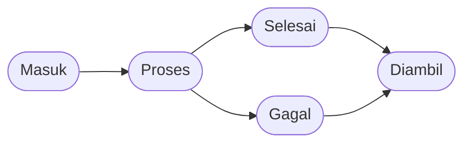
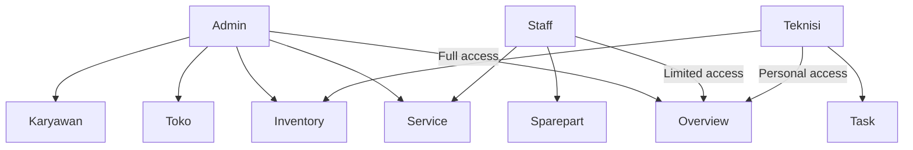

# Overview - RMS (Repair Management System)

## Apa itu RMS?

RMS (Repair Management System) adalah aplikasi web untuk mengelola servis handphone di service center. Sistem ini membantu Anda melacak proses servis dari mulai device masuk hingga customer mengambil hasilnya.

---

## Alur Servis

Setiap servis handphone mengikuti alur status yang jelas:

| Status | Arti |
|--------|------|
| **Masuk** (Received) | Device baru masuk, menunggu dikerjakan |
| **Proses** (Repairing) | Teknisi sedang memperbaiki device |
| **Selesai** (Done) | Servis sudah selesai, menunggu customer ambil |
| **Diambil** (Picked Up) | Customer sudah mengambil device, invoice lunas |
| **Gagal** (Failed) | Servis tidak berhasil (rusak permanen, customer cancel, dll) |

---

## Role Pengguna

RMS memiliki 3 jenis role dengan akses berbeda:

### 1. Admin

Role dengan akses paling lengkap. Admin bisa:

- **Overview**: Dashboard statistik lengkap (servis, pendapatan, inventory, staf)
- **Toko**: Mengelola informasi toko (nama, alamat, telepon, logo)
- **Service**: Mengelola semua servis — buat baru, edit, assign teknisi, hapus, mark paid, mark picked up
- **Karyawan**: Menambah dan menghapus Staff/Teknisi
- **Inventory**: Mengelola sparepart dan service pricelist

### 2. Staff

Role untuk mengelola customer dan servis:

- **Overview**: Dashboard ringkas (servis, inventory)
- **Service**: Buat servis baru, edit servis, assign teknisi, mark paid
- **Sparepart**: Lihat daftar sparepart dan stock

### 3. Teknisi

Role untuk teknisi yang mengerjakan servis:

- **Overview**: Dashboard personal (tugas yang dikerjakan)
- **Task**: Ambil tugas tersedia → kerjakan → mark selesai/gagal
- **Inventory**: Lihat sparepart untuk referensi

---

## Fitur Utama

### Manajemen Service Ticket

Setiap servis disimpan sebagai "ticket" dengan informasi:

- **Device**: Brand + model (dari katalog global)
- **Customer**: Nama (opsional) + nomor WhatsApp (wajib)
- **Keluhan**: Deskripsi masalah device
- **Password/Pattern**: Kunci device untuk testing (opsional)
- **IMEI**: Nomor IMEI device (opsional)
- **Teknisi**: Teknisi yang ditugaskan
- **Items**: Daftar biaya (sparepart + jasa servis)
- **Invoice**: Total biaya + status pembayaran

### Katalog Device (HpCatalog)

RMS menyediakan katalog brand dan model handphone yang **bersifat global** (bisa digunakan di semua toko). Saat membuat service ticket:

- Pilih device dari dropdown (autocomplete)
- Ketik brand baru + model → sistem otomatis buat entry baru

### Inventory (Sparepart & Service Pricelist)

#### Sparepart
- Setiap toko punya sparepart sendiri
- Setiap sparepart punya: nama, harga default, stock
- **Universal sparepart**: Bisa dipakai di device apa saja
- **Compatible sparepart**: Hanya cocok untuk device tertentu (bisa set kompatibilitas)
- Saat sparepart dipakai di servis → stock otomatis berkurang
- Saat item sparepart dihapus → stock otomatis kembali

#### Service Pricelist
- Template harga jasa servis (contoh: "Ganti LCD", "Repair IC", "Software")
- Untuk memudahkan input biaya jasa

### Invoice & Pembayaran

- Invoice dibuat otomatis saat item ditambahkan ke servis
- Grand total = total semua items (sparepart × qty + jasa)
- Status pembayaran: **Unpaid** atau **Paid**
- Mark "Paid" bisa dilakukan kapan saja
- Mark "Picked Up" = invoice otomatis lunas

### Multi-Toko

Admin bisa memiliki beberapa toko. Setiap toko:
- Punya inventory sparepart sendiri
- Punya service pricelist sendiri
- Punya karyawan (Staff/Teknisi) sendiri
- Data servis terpisah per toko

---

## Cara Kerja Workflow

### Untuk Staff/Admin: Membuat Servis Baru

1. Klik **"New Service"**
2. Pilih/ketik device (Brand + Model)
3. Isi nomor WhatsApp customer (wajib)
4. Isi nama customer (opsional)
5. Isi keluhan/masalah device
6. Isi password/pattern device (opsional — untuk testing)
7. Isi IMEI (opsional)
8. Klik **"Create Ticket"**

### Untuk Admin: Assign Teknisi

1. Di tabel servis, klik kolom "Teknisi"
2. Pilih teknisi dari dropdown
3. Status otomatis berubah ke **Proses** (Repairing)

### Untuk Teknisi: Ambil & Kerjakan Tugas

**Ambil tugas yang tersedia:**
1. Di halaman Task → tab "Tersedia"
2. Klik **"Take"** pada tugas yang ingin dikerjakan
3. Tugas masuk ke "My Tasks" → status jadi **Proses**

**Mengerjakan servis:**
1. Buka detail servis
2. Tambahkan item biaya:
   - Sparepart (pilih dari inventory)
   - Jasa servis (pilih dari pricelist atau isi manual)
3. Update notes/keterangan jika perlu

**Menyelesaikan servis:**
1. Klik **"Mark Done"** → status jadi **Selesai**
2. atau klik **"Mark Failed"** → status jadi **Gagal** (jika servis tidak berhasil)

### Untuk Staff/Admin: Finalisasi Servis

**Customer datang mengambil:**
1. Di tabel servis → baris status **Selesai** atau **Gagal**
2. Klik **"Pick Up"**
3. Status jadi **Diambil**, invoice otomatis lunas

**Customer membayar sebelum ambil:**
1. Klik **"Mark Paid"** di kolom invoice
2. Status invoice jadi **Paid** (servis tetap status **Selesai** sampai customer ambil)

---

## Tips Penggunaan

### Nomor WhatsApp
- Wajib diisi saat membuat servis
- Digunakan untuk notifikasi (opsional, jika ada integrasi WhatsApp)

### Password/Pattern Device
- Sangat membantu teknisi untuk testing device
- Bisa input sebagai text (PIN, password) atau pattern lock (visual)

### Sparepart Stock
- Cek stock sebelum assign sparepart ke servis
- Jika stock tidak cukup → sistem akan warning
- Sparepart yang sudah dipakai di servis tidak bisa dihapus

### Hapus Servis
- Servis dengan status **Diambil** tidak bisa dihapus
- Servis dengan invoice **Paid** tidak bisa dihapus

---

## Navigasi Sidebar

Setiap role punya navigasi berbeda:

| Role | Menu |
|------|------|
| Admin | Overview, Toko, Service (semua filter), Karyawan, Inventory |
| Staff | Overview, Service (semua filter), Sparepart |
| Teknisi | Overview, Task (Tersedia/Dikerjakan/Selesai/Gagal/History), Inventory |

Badge angka di sidebar menunjukkan jumlah servis di setiap status.

---

## Dokumentasi Detail

Untuk informasi lebih lengkap, lihat dokumentasi sub-topik:

| Dokumen | Konten |
|---------|--------|
| [Alur Servis](?doc=02-alur-servis) | Detail alur status servis, transisi, FAQ |
| [Role & Akses](?doc=03-role-dan-akses) | Detail role Admin/Staff/Teknisi, workflow |
| [Service Ticket](?doc=04-service-ticket) | Panduan membuat & mengelola ticket |
| [Inventory](?doc=05-inventory) | Panduan sparepart & service pricelist |
| [Invoice & Pembayaran](?doc=06-invoice-pembayaran) | Panduan invoice & pembayaran |
| [Multi-Toko](?doc=07-multi-toko) | Panduan fitur multi-toko |

---

## Teknologi

- Frontend: Next.js 16 + React + Tailwind CSS
- UI Components: shadcn/ui
- Backend: Next.js Server Actions
- Database: PostgreSQL + Prisma ORM
- Authentication: better-auth