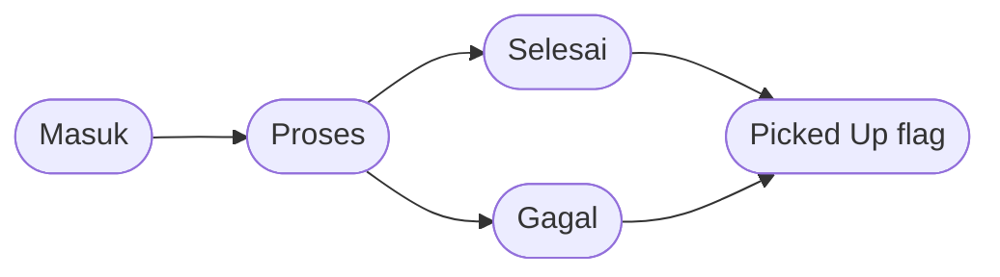
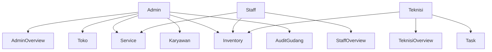

# Overview - RMS

RMS adalah aplikasi untuk mengelola servis handphone per toko, mulai dari ticket masuk, pengerjaan teknisi, inventory sparepart, sampai pembayaran dan pengambilan unit.

---

## Gambaran Sistem

- Aplikasi berjalan per toko. Setelah login, pengguna diarahkan ke toko pertama yang bisa diakses.
- Admin yang belum punya toko akan diarahkan ke halaman onboarding.
- Data servis, inventory, jasa, dan karyawan dipisahkan per toko.
- Katalog device bersifat global, jadi brand/model yang dibuat sekali bisa dipakai di semua toko.

---

## Alur Servis Saat Ini

Status servis yang dipakai sistem saat ini:

| Status / Flag | Arti |
|---|---|
| **Masuk** | Ticket baru dibuat dan belum mulai dikerjakan |
| **Proses** | Ticket sedang dikerjakan teknisi |
| **Selesai** | Perbaikan selesai |
| **Gagal** | Pengerjaan dihentikan / tidak berhasil |
| **Picked Up** | Penanda bahwa unit sudah diambil customer |

**Penting:** `Picked Up` bukan status terpisah. Setelah pickup, status servis tetap `Selesai` atau `Gagal`, lalu sistem menambahkan penanda `Picked Up` dan waktu `Picked Up At`.

---

## Role Dan Menu

### Admin

- `Admin Overview`
- `Toko`
- `Service`
- `Karyawan`
- `Inventory > Sparepart & Jasa`
- `Inventory > Audit Gudang`

### Staff

- `Staff Overview`
- `Service`
- `Inventory`

### Teknisi

- `Teknisi Overview`
- `Task`
- `Inventory`

---

## Fitur Inti Yang Sudah Ada

### Service ticket

- Admin dan Staff bisa membuat ticket baru.
- Device dipilih dari katalog global melalui pencarian.
- Jika device belum ada, form bisa membuat brand/model baru langsung dari input device.
- Field utama ticket: device, WhatsApp, nama customer, keluhan, password/pattern, dan IMEI.

### Pengerjaan teknisi

- Teknisi bisa mengambil task `Masuk` yang belum punya teknisi.
- Teknisi juga bisa takeover task `Masuk` atau `Proses` yang sedang dipegang teknisi lain.
- Teknisi yang ditugaskan bisa menambah item sparepart/jasa, menghapus item, lalu menandai `Selesai` atau `Gagal`.

### Inventory

- Admin mengelola sparepart dan jasa pada halaman `Inventory`.
- Sparepart bisa `Universal` atau dibatasi ke daftar device tertentu.
- Jasa disimpan sebagai daftar pricelist per toko.
- Stock sparepart otomatis berkurang saat item ditambahkan ke servis, dan kembali saat item dihapus atau ticket dihapus.
- `Audit Gudang` saat ini masih berupa mock UI, belum terhubung ke mutasi stock nyata.

### Invoice dan pembayaran

- Invoice belum ada saat ticket baru dibuat.
- Invoice muncul dan total dihitung setelah item pertama ditambahkan.
- Status pembayaran hanya `Unpaid` atau `Paid`.
- `Mark Paid` hanya bisa dilakukan pada servis yang sudah `Selesai` atau `Gagal`.
- `Pickup` tidak otomatis mengubah invoice menjadi `Paid`.

### Multi-toko

- Admin bisa membuat toko baru, edit toko, pindah toko, dan menghapus toko.
- Toko terakhir tidak bisa dihapus.

---

## Catatan Penting

- Halaman Staff tidak punya workflow assignment teknisi di UI saat ini.
- Perubahan inventory dibatasi ke Admin di backend.
- Invoice dibuka dari tabel saat statusnya `Paid`.
- Ticket yang sudah `Picked Up` tidak bisa diedit, diubah statusnya, atau dihapus.

---

## Dokumentasi Lanjutan

| Dokumen | Isi |
|---|---|
| [Alur Servis](?doc=02-alur-servis) | Status, transisi, pickup, dan takeover |
| [Role & Akses](?doc=03-role-dan-akses) | Hak akses per role |
| [Service Ticket](?doc=04-service-ticket) | Pembuatan dan pengelolaan ticket |
| [Inventory](?doc=05-inventory) | Sparepart, jasa, dan audit gudang |
| [Invoice & Pembayaran](?doc=06-invoice-pembayaran) | Cara kerja invoice dan payment |
| [Multi-Toko](?doc=07-multi-toko) | Pengelolaan toko dan isolasi data |
