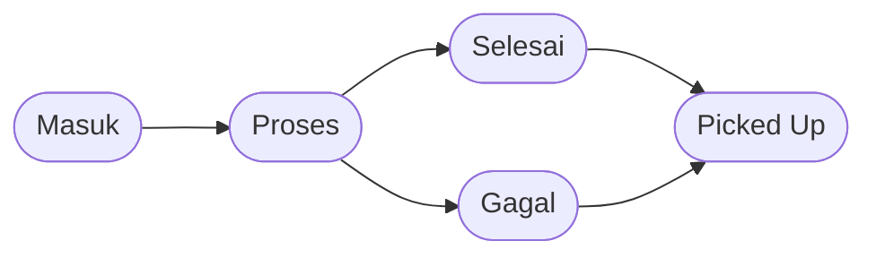

# Alur Servis

Dokumen ini menjelaskan alur servis yang benar-benar dipakai di aplikasi saat ini.

---

## Diagram

**Penting:** `Picked Up` adalah flag tambahan, bukan status database baru.

---

## Badge Status

:::demo StatusBadge

---

## Penjelasan Tiap Tahap

### 1. Masuk

Ticket baru dibuat oleh Admin atau Staff.

Kondisi umum:

- teknisi belum ditugaskan
- ticket muncul di menu `Masuk`
- teknisi lain bisa melihatnya di tab `Tersedia`

Aksi yang tersedia saat ini:

- Admin: edit ticket, hapus ticket, assign / unassign teknisi
- Staff: edit ticket, hapus ticket
- Teknisi: ambil task dari halaman `Task > Tersedia`

### 2. Proses

Servis masuk ke tahap ini ketika:

- Admin assign teknisi ke ticket `Masuk`
- Teknisi mengambil task `Masuk`

Pada tahap ini:

- teknisi yang ditugaskan bisa tambah atau hapus item
- teknisi yang ditugaskan bisa menandai `Selesai` atau `Gagal`
- Admin bisa membuka detail servis dan melakukan aksi yang sama dari sheet detail

**Catatan takeover:**

- Tab `Tersedia` teknisi juga menampilkan task `Proses` yang ditugaskan ke teknisi lain.
- Jika diambil, sistem meminta konfirmasi takeover dan assignment dipindah ke akun teknisi yang baru.

### 3. Selesai

Status ini muncul ketika teknisi atau Admin menekan `Mark Done` dari detail servis.

Perilaku saat ini:

- sistem menyimpan `doneAt`
- note keberhasilan disimpan dengan prefix `{BERHASIL}`
- item dan total invoice tetap bisa dilihat
- Staff atau Admin bisa menandai invoice `Paid`
- Staff atau Admin bisa melakukan `Picked up`

### 4. Gagal

Status ini muncul ketika teknisi atau Admin menekan `Mark Failed` dari detail servis.

Perilaku saat ini:

- alasan gagal wajib diisi
- note disimpan dengan prefix `{GAGAL}`
- Staff atau Admin tetap bisa menandai invoice `Paid`
- Staff atau Admin tetap bisa melakukan `Picked up`

### 5. Picked Up

Pickup dilakukan oleh Staff atau Admin untuk servis berstatus `Selesai` atau `Gagal`.

Saat pickup terjadi:

- sistem mengisi `isPickedUp = true`
- sistem mengisi `checkoutAt`
- servis pindah ke filter `Sudah Diambil`
- servis tidak bisa diedit, dihapus, atau diubah statusnya lagi

**Penting:** pickup **tidak** otomatis mengubah invoice ke `Paid`.

---

## Transisi Yang Didukung

| Dari | Ke | Siapa | Catatan |
|---|---|---|---|
| Baru dibuat | Masuk | Admin, Staff | Ticket baru selalu mulai dari `Masuk` |
| Masuk | Proses | Admin, Teknisi | Admin assign teknisi atau teknisi ambil task |
| Proses | Selesai | Admin, teknisi yang assigned | Dilakukan dari detail servis |
| Proses | Gagal | Admin, teknisi yang assigned | Alasan gagal wajib diisi |
| Selesai | Picked Up | Admin, Staff | Pickup hanya menambah flag |
| Gagal | Picked Up | Admin, Staff | Pickup hanya menambah flag |
| Selesai / Gagal | Masuk atau Proses | Admin, teknisi yang assigned | Tersedia lewat tombol `Undo` selama belum pickup |

---

## Undo Status

Servis yang sudah `Selesai` atau `Gagal` masih bisa di-undo dari sheet detail.

Undo saat ini bisa mengembalikan servis ke:

- `Masuk`
- `Proses`

Batasannya:

- tidak bisa dilakukan jika servis sudah `Picked Up`
- teknisi hanya bisa undo task yang memang ditugaskan ke dirinya

---

## Hubungan Dengan Pembayaran

- `Bayar` hanya tersedia jika invoice ada, status servis `Selesai` atau `Gagal`, dan servis belum pickup.
- `Bayar` mengubah status invoice menjadi `Paid`, tetapi tidak mengubah status servis.
- `Picked up` hanya menandai unit sudah diambil, bukan pembayaran.

---

## Ringkasan Praktis

1. Buat ticket -> status `Masuk`
2. Assign atau ambil task -> status `Proses`
3. Tambah item sparepart/jasa saat pengerjaan
4. Mark `Selesai` atau `Gagal`
5. Jika perlu, tandai invoice `Paid`
6. Saat unit keluar, lakukan `Picked up`
