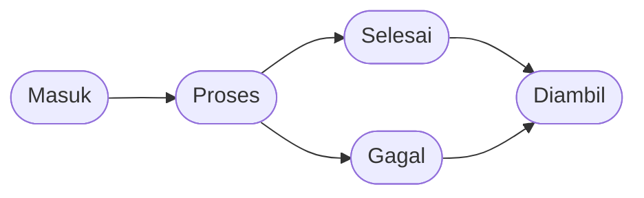

# Alur Servis (Service Flow)

Panduan lengkap tentang alur status servis di RMS.

---

## Diagram Alur

---

## Penjelasan Status

:::demo StatusBadge

### 1. Masuk (Received)

**Kapan terjadi?**
Status ini muncul saat service ticket baru dibuat oleh Staff atau Admin.

**Arti status:**
- Device sudah diterima di counter service
- Data customer dan keluhan sudah tercatat di sistem
- Belum ada teknisi yang ditugaskan
- Device masuk ke antrian untuk dikerjakan

**Aksi yang tersedia:**
- **Assign Teknisi**: Admin/Staff bisa menugaskan teknisi ke servis ini
- **Edit Data**: Ubah informasi device, customer, atau keluhan
- **Hapus Servis**: Bisa dihapus jika salah input (selama belum ada teknisi yang mengerjakan)

**Tampilan di sistem:**
- Warna badge: Biru
- Ditampilkan di tab "Masuk" di halaman Service
- Jumlah ditampilkan di badge sidebar

---

### 2. Proses (Repairing)

**Kapan terjadi?**
Status berubah ke "Proses" ketika teknisi ditugaskan ke servis tersebut.

**Pemicu perubahan status:**
1. Admin/Staff assign teknisi secara manual melalui halaman Service
2. Teknisi mengambil tugas dari halaman Task → tab "Tersedia"

**Arti status:**
- Teknisi sudah ditugaskan dan sedang mengerjakan device
- Item biaya (sparepart/jasa) bisa ditambahkan
- Notes/keterangan bisa diupdate

**Aksi yang tersedia:**

**Untuk Teknisi:**
- Tambah item biaya (sparepart dari inventory atau jasa servis)
- Update notes/keterangan pekerjaan
- Mark Done → status berubah ke "Selesai"
- Mark Failed → status berubah ke "Gagal"

**Untuk Admin/Staff:**
- Edit item biaya
- Ganti teknisi yang ditugaskan
- Lihat detail progress servis

**Tampilan di sistem:**
- Warna badge: Kuning/Oranye
- Untuk Teknisi: muncul di tab "Dikerjakan" di halaman Task
- Untuk Admin/Staff: muncul di tab "Proses" di halaman Service

---

### 3. Selesai (Done)

**Kapan terjadi?**
Status berubah ke "Selesai" ketika teknisi menekan tombol "Mark Done".

**Arti status:**
- Servis sudah selesai dikerjakan oleh teknisi
- Device siap diambil oleh customer
- Invoice sudah final (grand total sudah pasti)
- Menunggu customer datang untuk pembayaran dan pengambilan

**Aksi yang tersedia:**

**Untuk Admin/Staff:**
- **Mark Paid**: Menandai invoice sudah dibayar (jika customer bayar duluan)
- **Pick Up**: Menandai device sudah diambil customer → status "Diambil"
- **Edit Item**: Masih bisa edit item biaya jika ada koreksi

**Untuk Teknisi:**
- Muncul di tab "Selesai" di halaman Task (read-only)

**Tampilan di sistem:**
- Warna badge: Hijau
- Invoice status: Unpaid (default) atau Paid (jika sudah dibayar)
- Ditampilkan di tab "Selesai" di halaman Service

---

### 4. Diambil (Picked Up)

**Kapan terjadi?**
Status berubah ke "Diambil" ketika Admin/Staff menekan tombol "Pick Up".

**Arti status:**
- Customer sudah mengambil device
- Invoice otomatis dianggap lunas (Paid)
- Servis selesai secara keseluruhan
- Data servis tidak bisa diubah atau dihapus

**Penting diketahui:**
- Status ini adalah final, tidak bisa di-undo
- Semua data terkait servis terkunci (tidak bisa edit)
- Servis dengan status "Diambil" tidak bisa dihapus
- Data akan masuk ke history/laporan

**Tampilan di sistem:**
- Warna badge: Abu-abu
- Ditampilkan di tab "History" atau "Diambil" di halaman Service

---

### 5. Gagal (Failed)

**Kapan terjadi?**
Status berubah ke "Gagal" ketika teknisi menekan tombol "Mark Failed".

**Alasan servis gagal:**
- Device rusak permanen (tidak bisa diperbaiki)
- Customer membatalkan servis
- Sparepart tidak tersedia dan tidak bisa order
- Biaya terlalu mahal, customer tidak mau lanjut

**Arti status:**
- Servis tidak berhasil diselesaikan
- Device siap dikembalikan ke customer
- Invoice bisa tetap ada biaya (jika ada komponen yang sudah dipasang, dll)
- Customer tetap perlu datang untuk mengambil device

**Aksi yang tersedia:**
- **Pick Up**: Menandai device sudah dikembalikan ke customer → status "Diambil"
- **Mark Paid**: Jika ada biaya yang tetap perlu dibayar

**Tampilan di sistem:**
- Warna badge: Merah
- Untuk Teknisi: muncul di tab "Gagal" di halaman Task
- Untuk Admin/Staff: muncul di tab "Gagal" di halaman Service

---

## Transisi Status

| Dari | Ke | Pemicu | Siapa |
|------|-----|--------|-------|
| - | Masuk | Buat service ticket baru | Admin, Staff |
| Masuk | Proses | Assign teknisi / Teknisi ambil tugas | Admin, Staff, Teknisi |
| Proses | Selesai | Mark Done | Teknisi |
| Proses | Gagal | Mark Failed | Teknisi |
| Selesai | Diambil | Pick Up | Admin, Staff |
| Gagal | Diambil | Pick Up | Admin, Staff |

---

## FAQ

### Q: Bisakah status "Selesai" dikembalikan ke "Proses"?

**Tidak.** Setelah teknisi menekan "Mark Done", status tidak bisa di-undo. Jika ternyata ada masalah, solusinya:
1. Buat service ticket baru untuk servis ulang
2. Atau hubungi Admin untuk penanganan khusus via database

### Q: Bisakah servis dihapus setelah status "Proses"?

**Ya, dengan syarat:**
- Invoice belum dibayar (Unpaid)
- Belum ada transaksi yang terkunci

Namun, disarankan untuk **tidak menghapus** servis yang sudah masuk proses. Lebih baik biarkan teknisi menyelesaikan (Done atau Failed).

### Q: Apa bedanya "Mark Paid" dan "Pick Up"?

| Mark Paid | Pick Up |
|-----------|---------|
| Menandai invoice sudah dibayar | Menandai device sudah diambil |
| Status servis tetap "Selesai" | Status berubah ke "Diambil" |
| Data masih bisa diedit | Data terkunci, tidak bisa edit |
| Bisa dilakukan kapan saja | Final, tidak bisa di-undo |

### Q: Bisakah customer ambil device tanpa bayar?

Sistem mengasumsikan "Pick Up" = invoice lunas. Jika ada kasus khusus (garansi, dll), Admin bisa:
1. Edit invoice → set grand total ke 0
2. Kemudian baru Pick Up

---

## Tips Praktis

### Untuk Staff/Admin

1. **Selalu cek status sebelum aksi**
   - Servis "Diambil" tidak bisa diapa-apakan
   - Servis "Paid" tidak bisa dihapus

2. **Komunikasi dengan customer**
   - Update customer saat status berubah (opsional, jika ada integrasi WhatsApp)
   - Konfirmasi pembayaran sebelum Pick Up

3. **Dokumentasi**
   - Pastikan notes servis lengkap
   - Simpan foto jika perlu (di luar sistem, untuk sekarang)

### Untuk Teknisi

1. **Update progress berkala**
   - Tambah notes saat ada perkembangan
   - Jangan biarkan servis "menggantung" lama tanpa update

2. **Cek stock sparepart**
   - Sebelum mulai kerjakan, pastikan sparepart tersedia
   - Jika stock tidak cukup, update notes dan koordinasi dengan Admin

3. **Mark Failed dengan alasan jelas**
   - Jelaskan di notes kenapa servis gagal
   - Ini penting untuk rekam jejak dan komunikasi ke customer