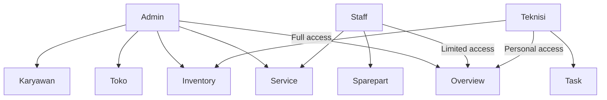
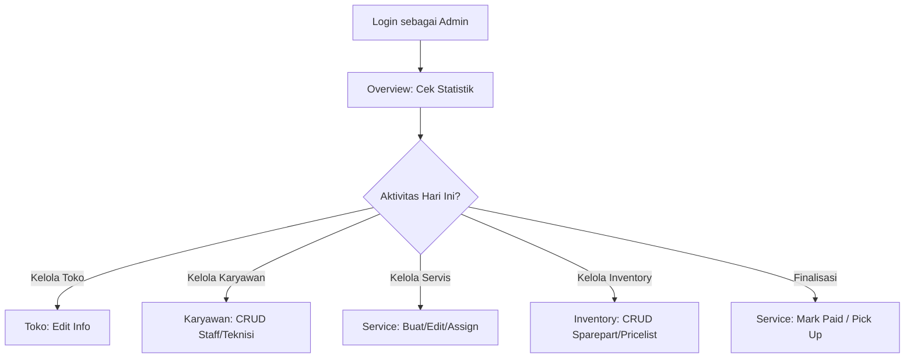
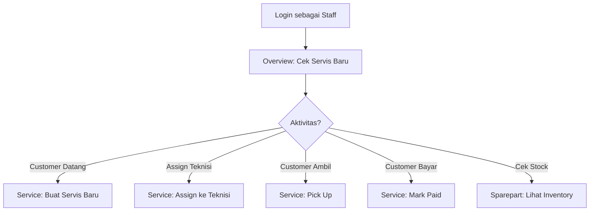
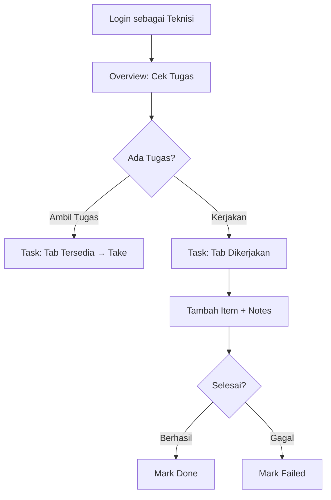

# Role & Akses (Roles & Permissions)

Panduan lengkap tentang jenis pengguna dan hak akses di RMS.

---

## Diagram Role

---

## Perbandingan Role

| Fitur | Admin | Staff | Teknisi |
|-------|-------|-------|---------|
| Overview (Full Stats) | ✓ | ✗ | ✗ |
| Overview (Limited) | ✓ | ✓ | ✓ |
| Kelola Toko | ✓ | ✗ | ✗ |
| Buat Servis Baru | ✓ | ✓ | ✗ |
| Edit Servis | ✓ | ✓ | ✗ |
| Hapus Servis | ✓ | ✓* | ✗ |
| Assign Teknisi | ✓ | ✓ | ✗ |
| Mark Paid | ✓ | ✓ | ✗ |
| Pick Up | ✓ | ✓ | ✗ |
| Kelola Karyawan | ✓ | ✗ | ✗ |
| Kelola Inventory | ✓ | ✗ | ✗ |
| Lihat Sparepart | ✓ | ✓ | ✓ |
| Ambil Tugas | ✗ | ✗ | ✓ |
| Kerjakan Servis | ✗ | ✗ | ✓ |
| Mark Done/Failed | ✗ | ✗ | ✓ |

*Staff hanya bisa hapus servis yang belum diambil dan belum dibayar

**Tampilan sidebar untuk setiap role:**

:::demo SidebarNav

---

## Admin

### Deskripsi

Role dengan akses paling lengkap. Biasanya dimiliki oleh pemilik toko atau manager.

### Menu yang Tersedia

| Menu | Akses |
|------|-------|
| **Overview** | Full statistik (servis, pendapatan, inventory, karyawan) |
| **Toko** | Kelola informasi toko, buat toko baru |
| **Service** | Semua filter (Masuk, Proses, Selesai, Gagal, Diambil) |
| **Karyawan** | CRUD Staff dan Teknisi |
| **Inventory** | CRUD Sparepart dan Service Pricelist |

### Detail Fitur

#### Overview

Dashboard dengan statistik lengkap:

- **Statistik Servis**
  - Jumlah servis per status (hari ini, minggu ini, bulan ini)
  - Grafik trend servis
  - Rata-rata waktu pengerjaan

- **Statistik Pendapatan**
  - Total pendapatan (hari ini, minggu ini, bulan ini)
  - Pendapatan per teknisi
  - Pendapatan per jenis servis

- **Statistik Inventory**
  - Jumlah sparepart
  - Stock menipis
  - Sparepart terlaris

- **Statistik Karyawan**
  - Jumlah staff dan teknisi
  - Performa per teknisi (jumlah servis selesai)

#### Toko

Mengelola informasi toko:

- **Edit Informasi Toko**
  - Nama toko
  - Alamat
  - Nomor telepon
  - Logo toko

- **Multi-Toko** (jika fitur aktif)
  - Buat toko baru
  - Pindah antar toko
  - Kelola inventory per toko

#### Service

Akses penuh ke semua servis:

- **Create**: Buat service ticket baru
- **Read**: Lihat semua servis di semua status
- **Update**: Edit data servis, assign teknisi, mark paid
- **Delete**: Hapus servis (dengan batasan)
- **Pick Up**: Finalisasi servis

Filter yang tersedia:
- Semua (All)
- Masuk (Received)
- Proses (Repairing)
- Selesai (Done)
- Gagal (Failed)
- Diambil (Picked Up)

#### Karyawan

Mengelola akun pengguna:

- **Tambah Karyawan**
  - Input email, nama, password
  - Pilih role (Staff atau Teknisi)
  - Assign ke toko (jika multi-toko)

- **Edit Karyawan**
  - Ubah nama, email
  - Reset password
  - Ubah role
  - Ubah status (active/inactive)

- **Hapus Karyawan**
  - Non-aktifkan akun
  - Hapus permanen (jika belum ada aktivitas)

#### Inventory

Mengelola sparepart dan pricelist:

- **Sparepart**
  - Tambah sparepart baru
  - Set kompatibilitas device (universal atau specific)
  - Update stock
  - Set harga default

- **Service Pricelist**
  - Tambah template jasa servis
  - Set harga default per jenis jasa
  - Contoh: "Ganti LCD", "Repair IC", "Software", "Ganti Baterai"

---

## Staff

### Deskripsi

Role untuk mengelola customer dan servis. Biasanya dimiliki oleh orang yang melayani di counter.

### Menu yang Tersedia

| Menu | Akses |
|------|-------|
| **Overview** | Statistik ringkas (servis, inventory) |
| **Service** | Semua filter (buat, edit, assign, finalisasi) |
| **Sparepart** | Read-only, lihat daftar sparepart dan stock |

### Detail Fitur

#### Overview

Dashboard dengan statistik ringkas:

- **Statistik Servis**
  - Jumlah servis per status
  - Servis yang perlu perhatian (menunggu lama, dll)

- **Statistik Inventory**
  - Stock menipis (warning)
  - Sparepart yang sering dipakai

*Tidak ada statistik pendapatan atau karyawan*

#### Service

Akses hampir sama dengan Admin, kecuali:

| Aksi | Admin | Staff |
|------|-------|-------|
| Buat servis baru | ✓ | ✓ |
| Edit servis | ✓ | ✓ |
| Assign teknisi | ✓ | ✓ |
| Mark paid | ✓ | ✓ |
| Pick up | ✓ | ✓ |
| Hapus servis | ✓ | ✓* |
| Hapus servis (paid/picked up) | ✓ | ✗ |
| Lihat semua toko | ✓ | ✗** |

*Staff hanya bisa hapus servis yang invoice-nya Unpaid dan statusnya belum Diambil
**Staff hanya bisa lihat servis di toko tempat dia bekerja

#### Sparepart

Akses read-only:

- Lihat daftar sparepart
- Cek stock
- Lihat harga
- Cari sparepart

*Tidak bisa tambah, edit, atau hapus sparepart*

---

## Teknisi

### Deskripsi

Role untuk teknisi yang mengerjakan servis. Akses bersifat personal (hanya tugas yang ditugaskan ke dia).

### Menu yang Tersedia

| Menu | Akses |
|------|-------|
| **Overview** | Dashboard personal (tugas sendiri) |
| **Task** | Kelola tugas (ambil, kerjakan, selesaikan) |
| **Inventory** | Read-only, lihat sparepart untuk referensi |

### Detail Fitur

#### Overview

Dashboard personal:

- **My Tasks**
  - Jumlah tugas sedang dikerjakan
  - Jumlah tugas selesai
  - Jumlah tugas gagal

- **Performance**
  - Servis selesai hari ini
  - Servis selesai minggu ini
  - Rata-rata waktu pengerjaan

*Tidak ada statistik toko atau karyawan lain*

#### Task

Menu utama untuk teknisi. Terdiri dari beberapa tab:

##### Tab "Tersedia"

Menampilkan servis yang:
- Status "Masuk" (Received)
- Belum ada teknisi yang ditugaskan

Aksi:
- **Take**: Ambil tugas → status berubah ke "Proses", teknisi ter-assign

##### Tab "Dikerjakan"

Menampilkan servis yang:
- Status "Proses" (Repairing)
- Ditugaskan ke teknisi tersebut

Aksi:
- **Lihat Detail**: Buka halaman detail servis
- **Tambah Item**: Tambah sparepart/jasa ke invoice
- **Update Notes**: Tambah keterangan pekerjaan
- **Mark Done**: Selesaikan servis → status "Selesai"
- **Mark Failed**: Gagal servis → status "Gagal"

##### Tab "Selesai"

Menampilkan servis yang:
- Status "Selesai" (Done)
- Dikerjakan oleh teknisi tersebut

Aksi:
- Read-only (tidak bisa edit)

##### Tab "Gagal"

Menampilkan servis yang:
- Status "Gagal" (Failed)
- Dikerjakan oleh teknisi tersebut

Aksi:
- Read-only (tidak bisa edit)

##### Tab "History"

Menampilkan semua servis yang pernah dikerjakan oleh teknisi tersebut, termasuk yang sudah "Diambil".

#### Inventory

Akses read-only:

- Lihat daftar sparepart
- Cek ketersediaan stock
- Lihat harga
- Cari sparepart untuk referensi

*Tidak bisa tambah, edit, atau hapus sparepart*

---

## Workflow Per Role

### Admin Workflow

### Staff Workflow

### Teknisi Workflow

---

## FAQ

### Q: Bisakah satu akun punya multiple role?

**Tidak.** Setiap akun hanya punya satu role: Admin, Staff, atau Teknisi.

Jika ada orang yang perlu akses berbeda untuk situasi berbeda, solusinya:
- Buat dua akun terpisah dengan role berbeda
- Atau berikan role dengan akses lebih tinggi (Admin)

### Q: Bagaimana cara mengubah role seseorang?

Hanya **Admin** yang bisa mengubah role:
1. Buka menu "Karyawan"
2. Cari akun yang ingin diubah
3. Klik "Edit"
4. Ubah role di dropdown
5. Simpan perubahan

### Q: Bisakah Staff mengakses data teknisi lain?

**Tidak.** Staff hanya bisa:
- Lihat semua servis (termasuk yang dikerjakan teknisi lain)
- Tidak bisa lihat performa/statistik teknisi
- Tidak bisa kelola akun teknisi

### Q: Bisakah Teknisi melihat servis teknisi lain?

**Tidak.** Teknisi hanya bisa:
- Lihat servis yang ditugaskan ke dia
- Lihat servis yang tersedia (belum ada teknisi) di tab "Tersedia"
- Tidak bisa lihat servis teknisi lain

### Q: Siapa yang bisa menghapus servis?

| Role | Bisa Hapus Servis? |
|------|-------------------|
| Admin | Ya, dengan batasan: belum Diambil dan belum Paid |
| Staff | Ya, dengan batasan: belum Diambil dan belum Paid |
| Teknisi | Tidak |

---

## Tips Praktis

### Untuk Admin

1. **Kelola karyawan dengan bijak**
   - Buat akun Staff/Teknisi sesuai kebutuhan
   - Non-aktifkan akun karyawan yang sudah resign (jangan hapus)

2. **Monitor performa**
   - Gunakan Overview untuk cek statistik toko
   - Lihat performa teknisi di laporan

3. **Kelola inventory secara rutin**
   - Update stock sparepart
   - Tambah template jasa di pricelist

### Untuk Staff

1. **Komunikasi dengan teknisi**
   - Assign teknisi sesuai keahlian
   - Informasikan jika ada servis urgent

2. **Dokumentasi lengkap**
   - Isi semua field saat buat servis baru
   - Catat password/pattern device untuk memudahkan teknisi

3. **Finalisasi tepat waktu**
   - Pick Up segera setelah customer ambil
   - Mark Paid sesuai pembayaran aktual

### Untuk Teknisi

1. **Ambil tugas sesuai kapasitas**
   - Jangan terlalu banyak tugas bersamaan
   - Prioritaskan tugas yang sudah lama menunggu

2. **Update progress berkala**
   - Tambah notes saat ada perkembangan
   - Jangan biarkan customer menunggu tanpa update

3. **Komunikasi jika ada masalah**
   - Jika sparepart tidak ada, update notes
   - Koordinasi dengan Staff/Admin jika ada kendala